# Mermaid — Biểu Đồ Từ Markdown

> Mermaid là công cụ JavaScript tạo diagram từ văn bản Markdown-like. Viết text → render thành hình. Hỗ trợ nhiều loại diagram, dùng được trong GitHub, GitLab, Notion, VitePress, và nhiều IDE.

---

## Tổng quan

**Tại sao dùng Mermaid?**
- Không cần tool vẽ hình — viết code trong `.md` file
- Version control-friendly — diff rõ ràng khi thay đổi diagram
- Render trực tiếp trên GitHub/GitLab
- Hỗ trợ nhiều loại diagram phổ biến

**Cài đặt:** Không cần cài — dùng trực tiếp trong Markdown fenced code block.

```text
    ```mermaid
    graph LR
        A[Text] --> B[Rendered Diagram]
    ```
```

được kết quả như sau

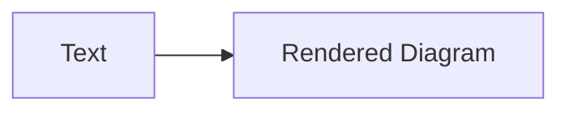


---

## Flowchart — Sơ đồ luồng

Cơ bản và hay dùng nhất. Dùng `graph` (tự chọn hướng) hoặc `flowchart` (nâng cao hơn).

### Hướng vẽ

| Khởi tạo | Hướng |
|----------|-------|
| `graph TD` / `flowchart TD` | Top → Down |
| `graph LR` / `flowchart LR` | Left → Right |
| `graph BT` | Bottom → Top |
| `graph RL` | Right → Left |

### Ví dụ cơ bản

```text
    ```mermaid
    graph LR
        A[Bắt đầu] --> B{Quyết định}
        B -->|Có| C[Làm việc]
        B -->|Không| D[Nghỉ ngơi]
        C --> E[Kết thúc]
        D --> E
    ```
```

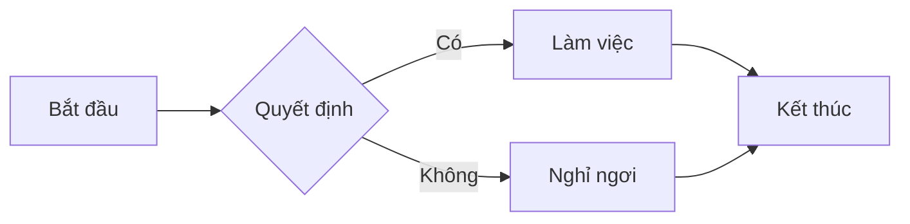

### Các loại node

```text
    ```mermaid
    graph TD
        A[Rectangle] --> B(Rounded)
        B --> C{Diamond}
        C --> D[(Cylinder/DB)]
        D --> E[[Subroutine]]
        E --> F((Circle))
        F --> G{Hexagon}
    ```
```

| Cú pháp | Hình dạng | Tên |
|---------|-----------|-----|
| `[Text]` | Rectangle | Hình chữ nhật |
| `(Text)` | Rounded | Bo tròn |
| `{Text}` | Diamond (rhombus) | Hình thoi |
| `[(Text)]` | Cylinder | Database |
| `[[Text]]` | Subroutine | Hình chữ nhật kép |
| `((Text))` | Circle | Hình tròn |

### Link & Label

```text
    ```mermaid
    graph LR
        A -->|label| B
        A --- B
        A -.->|dashed| B
        A ==>|thick| B
        A -->|text & link| B
    ```
```

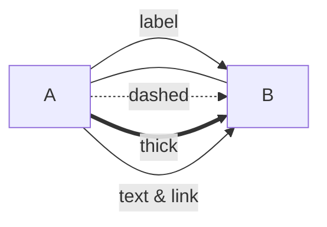

| Ký hiệu | Kiểu |
|---------|------|
| `-->` | Solid arrow |
| `---` | Solid line (không mũi tên) |
| `-.->` | Dashed arrow |
| `==>` | Thick arrow |
| `--o` | Line with circle |

### Subgraph — Nhóm node

```text
    ```mermaid
    graph TD
        subgraph Backend
            A[API] --> B[Service]
            B --> C[Repository]
        end
        subgraph Database
            D[(MySQL)] --> E[(Redis)]
        end
        C --> D
    ```
```

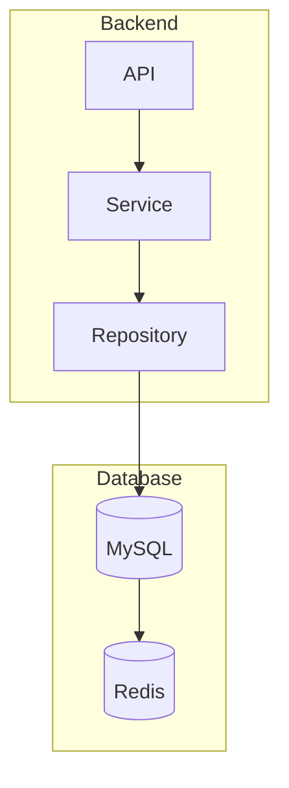

---

## Sequence Diagram — Sơ đồ tương tác

Mô tả luồng giao tiếp giữa các đối tượng theo thời gian.

### Ví dụ cơ bản

```text
    ```mermaid
    sequenceDiagram
        participant User
        participant FE as Frontend
        participant BE as Backend
        participant DB as Database

        User->>FE: Nhấn nút Login
        FE->>BE: POST /api/login
        BE->>DB: SELECT user
        DB-->>BE: User data
        BE-->>FE: JWT token
        FE-->>User: Trang chủ
    ```
```

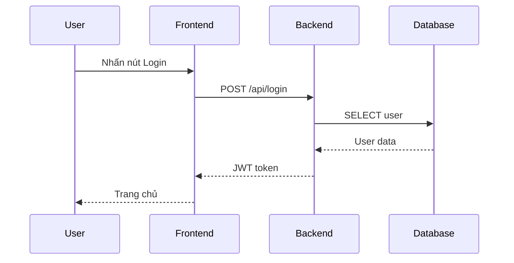

### Các loại arrow

| Cú pháp | Kiểu |
|---------|------|
| `->>` | Solid arrow (request) |
| `-->>` | Dashed arrow (response) |
| `->` | Solid, không mũi tên |
| `-->>` | Dashed, mũi tên |
| `-x` | X (message fails) |
| `--)` | Không gửi được (dashed) |

### Activation & Note

```text
    ```mermaid
    sequenceDiagram
        participant A
        participant B

        Note over A,B: Giai đoạn 1
        A->>B: Request
        activate A
        activate B
        B-->>A: Response
        deactivate B
        deactivate A

        Note right of A: Xử lý local
        Note left of B: Lưu cache
    ```
```

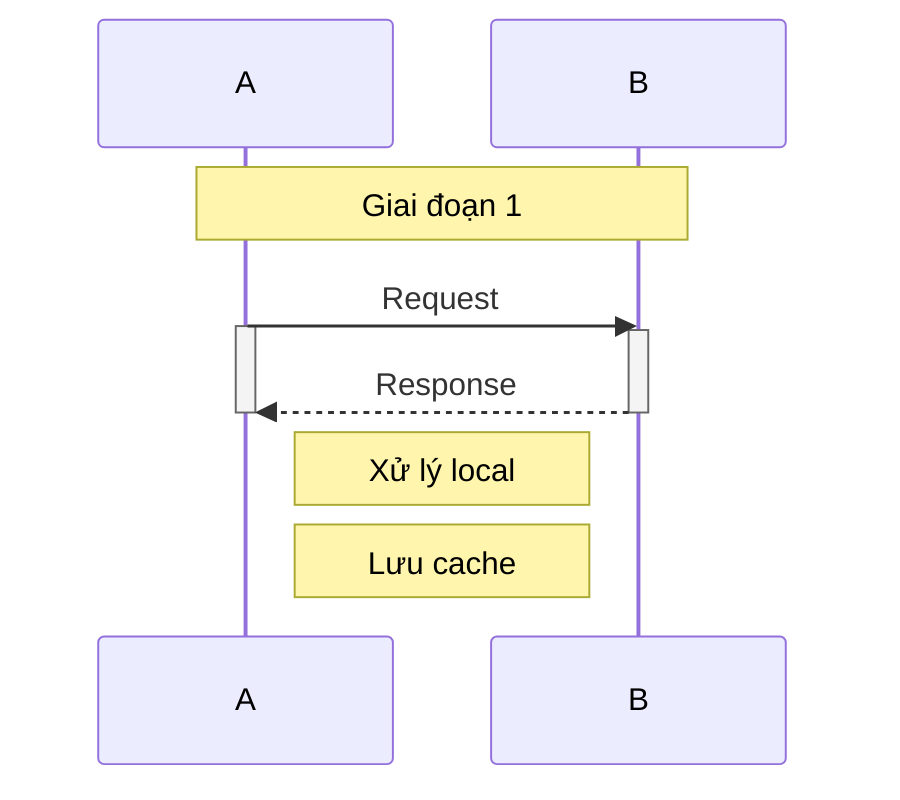

### Loop & Alt

```text
    ```mermaid
    sequenceDiagram
        participant C as Client
        participant S as Server

        loop Mỗi 30s
            C->>S: Health check
            S-->>C: OK
        end

        alt Thành công
            C->>S: Gửi data
            S-->>C: 200 OK
        else Lỗi
            C->>S: Gửi data
            S-->>C: 500 Error
        end
    ```
```

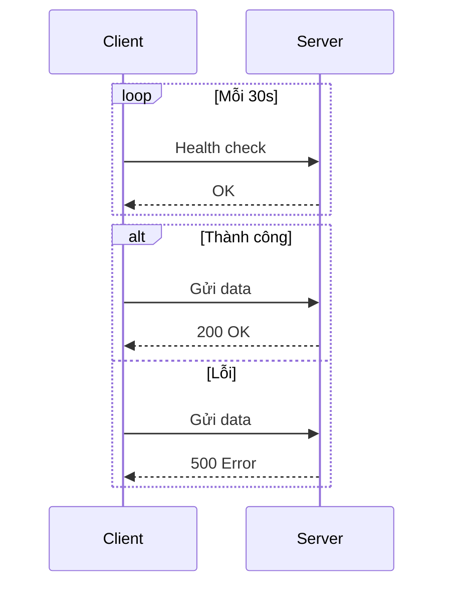

---

## Class Diagram — Sơ đồ lớp

Mô tả cấu trúc các lớp (class), mối quan hệ inheritance, composition.

```text
    ```mermaid
    classDiagram
        class Animal {
            +String name
            +int age
            +makeSound()
        }
        class Dog {
            +fetch()
        }
        class Cat {
            +purr()
        }
        Animal <|-- Dog
        Animal <|-- Cat
    ```
```

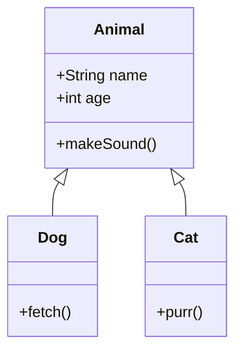

### Visibility

| Ký hiệu | Ý nghĩa |
|---------|----------|
| `+` | Public |
| `-` | Private |
| `#` | Protected |
| `~` | Package/Internal |

### Mối quan hệ

| Cú pháp | Ý nghĩa |
|---------|----------|
| `<\|--` | Inheritance |
| `*--` | Composition |
| `o--` | Aggregation |
| `-->` | Association |
| `..>` | Dependency |
| `..|>` | Realization |

---

## State Diagram — Sơ đồ trạng thái

Mô tả các trạng thái và chuyển đổi trạng thái của đối tượng.

```text
    ```mermaid
    stateDiagram-v2
        [*] --> Idle
        Idle --> Processing: Start
        Processing --> Done: Complete
        Processing --> Error: Fail
        Error --> Processing: Retry
        Done --> [*]
    ```
```

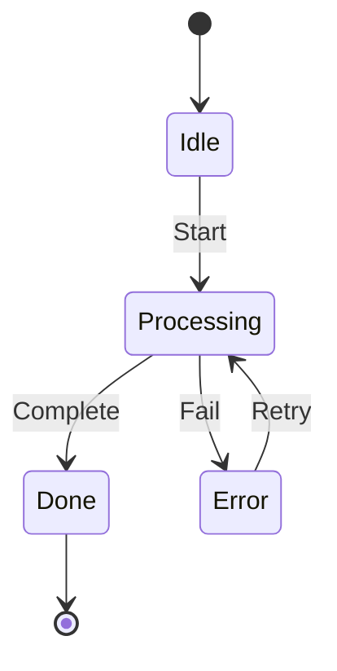

---

## Gantt Chart — Biểu đồ lịch trình

Dự án, planning, timeline.

```text
    ```mermaid
    gantt
        title Lịch Trình Dự Án
        dateFormat YYYY-MM-DD

        section Planning
        Nghiên cứu需求    :a1, 2026-07-01, 7d
        Thiết kế          :a2, after a1, 5d

        section Development
        Backend           :b1, after a2, 14d
        Frontend          :b2, after a2, 14d

        section Testing
        Unit Test         :c1, after b1, 5d
        Integration Test  :c2, after c1, 5d
    ```
```

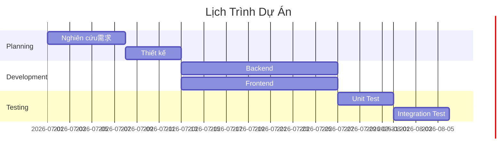

### Thuật ngữ Gantt

| Thuật ngữ | Ý nghĩa |
|-----------|----------|
| `after <id>` | Bắt đầu sau task kết thúc |
| `crit` | Đánh dấu quan trọng (màu đỏ) |
| `active` | Đang thực hiện |
| `done` | Hoàn thành |

---

## Pie Chart — Biểu đồ tròn

```text
    ```mermaid
    pie
        title Phân Bổ Thời Gian
        "Coding" : 45
        "Meeting" : 20
        "Debugging" : 25
        "Documentation" : 10
    ```
```

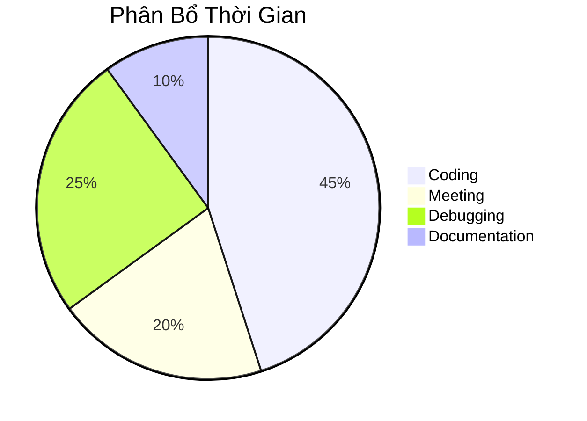

---

## Gitgraph — Sơ đồ Git Branch

```text
    ```mermaid
    gitGraph
        commit
        commit
        branch develop
        checkout develop
        commit
        commit
        checkout main
        merge develop
        commit
    ```
```

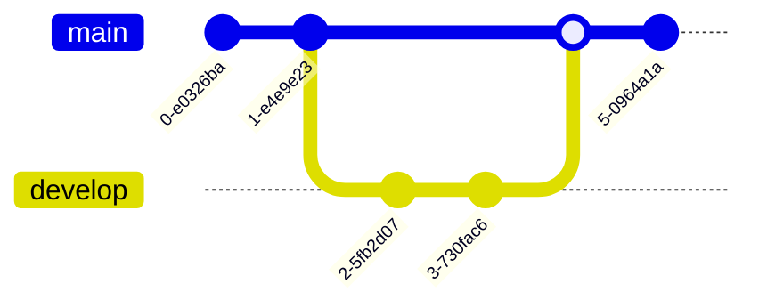

---

## Timeline — Dòng thời gian

```text
    ```mermaid
    timeline
        title Lịch Sử JavaScript
        1995 : Brendan Eich tạo JavaScript
        2006 : jQuery ra mắt
        2010 : AngularJS
        2013 : React, io.js
        2015 : ES6, Vue.js, Node.js 4.0
        2020 : Deno 1.0
    ```
```

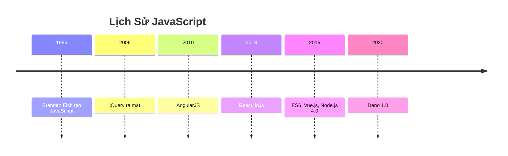

---

## XYZ Chart — Biểu đồ XY

```text
    ```mermaid
    xychart-beta
        title "Doanh Thu"
        x-axis [Jan, Feb, Mar, Apr]
        y-axis "Triệu VNĐ" 0 --> 100
        bar [30, 45, 60, 80]
        line [30, 50, 55, 75]
    ```
```

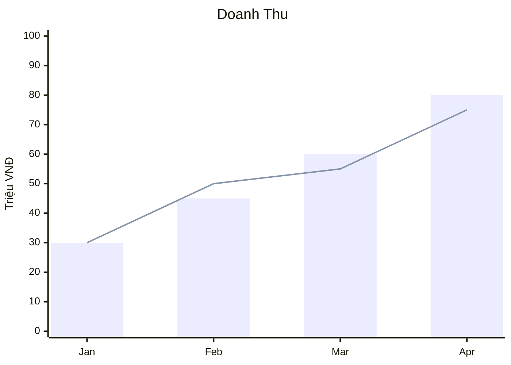

---

## Sử Dụng Trong Markdown

### GitHub / GitLab

Render tự động khi xem file `.md` trên giao diện web. Không cần cài thêm gì.

```markdown

```

### VitePress

VitePress hỗ trợ Mermaid qua plugin. Thêm vào `docs/.vitepress/config.js`:

```js
import { defineConfig } from 'vitepress'

export default defineConfig({
  markdown: {
    lineNumbers: true,
    config: (md) => {
      md.use(require('markdown-it-mermaid'))
    }
  }
})
```

### VS Code

Cài extension **Markdown Preview Mermaid Support** để xem preview Mermaid trong VS Code.

### HTML Standalone

```html
<script type="module">
  import mermaid from 'https://cdn.jsdelivr.net/npm/mermaid/dist/mermaid.esm.min.mjs'
  mermaid.initialize({ startOnLoad: true })
</script>
<pre class="mermaid">
graph LR
    A --> B
</pre>
```

---

## Tips & Tricks

### Comment trong diagram

Dùng `%%` để thêm comment — không render trên diagram.

```text
    ```mermaid
    graph LR
        %% Đây là comment
        A --> B
    ```
```


### Thay đổi style

```text
    ```mermaid
    graph TD
        A[Normal] --> B[Success]
        A --> C[Failed]

        style B fill:#9f6,stroke:#333,stroke-width:2px
        style C fill:#f66,stroke:#333,stroke-width:2px
    ```
```

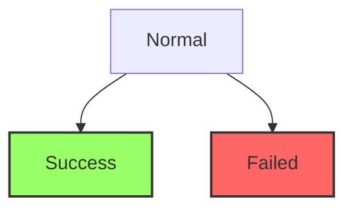

### Đặc biệt: Multi-line text trong node

```text
    ```mermaid
    graph TD
        A["Line 1<br/>Line 2<br/>Line 3"]
    ```
```

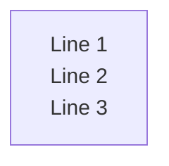

### Liên kết URL trong node

```text
    ```mermaid
    graph TD
        A["Google (click)"] --> B
        click A href "https://google.com" _blank
    ```
```

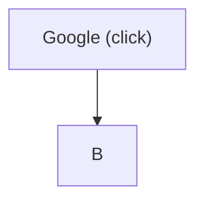

### Theme

```text
    ```mermaid
    ---
    theme: dark
    ---
    graph LR
        A --> B
    ```
```


Themes: `default`, `forest`, `dark`, `neutral`, `mc` (Minecraft style).

---

## Tham Khảo

- [Mermaid Live Editor](https://mermaid.live/) — Viết & preview trực tuyến
- [Mermaid Docs](https://mermaid.js.org/intro/) — Tài liệu chính thức
- [Mermaid CLI](https://mermaid.js.org/packages/mermaid-cli/) — Render PNG/SVG từ terminal
- [GitHub Markdown Spec — Diagrams](https://github.github.com/gfm/#diagrams)

---

*Tài liệu được tạo ngày 11-07-2026 — Mermaid.*
